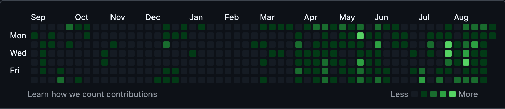

# GitHub Contribution Automation Tool

A local automation tool that creates regular commits to a private GitHub repository to maintain an active contribution graph, running locally on your machine.

# Screenshot



## What is the objective of the repo?

This repository provides a local automation solution to maintain an active GitHub contribution graph by automatically creating commits at scheduled intervals. Unlike cloud-based solutions, this tool runs entirely on your local machine, giving you full control over the automation process.

### Key Features:
- **Local Execution**: Runs on your local machine, not on remote servers
- **Automated Scheduling**: Uses cron jobs to run commits at specified times
- **Private Repository**: Creates and manages a private repository for your commits
- **Comprehensive Logging**: Detailed logs for monitoring and debugging
- **Error Handling**: Robust error handling and recovery mechanisms

## How does it work?

The automation tool works through a series of interconnected scripts:

1. **Repository Management**: Creates a private GitHub repository if it doesn't exist
2. **Timestamp Generation**: Creates a timestamp file with current date/time
3. **Git Operations**: Clones the repository, adds the timestamp file, commits, and pushes changes
4. **Scheduling**: Uses cron jobs to run the automation at specified intervals (9:00 AM, 2:00 PM, 7:00 PM daily)
5. **Logging**: Maintains detailed logs of all operations for monitoring and debugging

### Workflow:
```
Cron Job → cronjob.sh → run-all.sh → commit.sh → GitHub Repository
```

## How to use it?

### Prerequisites
Before using this tool, ensure you have the following installed and configured:

- **GitHub CLI (`gh`)**: Install from [GitHub CLI](https://cli.github.com/)
- **Git**: Install from [Git](https://git-scm.com/)
- **Cron Access**: Ensure your system supports cron jobs (Linux or Mac)

### Installation

1. **Clone or download this repository** to your local machine
2. **Authenticate with GitHub CLI**:
   ```bash
   gh auth login
   ```
3. **Make scripts executable**:
   ```bash
   chmod +x *.sh
   ```

### Quick Start

Run the master script to set up everything automatically:

```bash
./run-all.sh
```

This will:
- Check all prerequisites
- Create the private repository (if it doesn't exist)
- Run an initial commit
- Set up the cron job for automated execution

## How to configure it?

### Repository Configuration
The tool uses the following default configuration:

- **Repository Name**: `github-contribution-graph-action`
- **Visibility**: Configurable (private/public via `REPO_VISIBILITY` variable)
- **Description**: "Automated GitHub contribution graph tool"

### Schedule Configuration
The cron job is configured to run at:
- **9:00 AM** (09:00)
- **2:00 PM** (14:00) 
- **7:00 PM** (19:00)

Cron syntax: `0 9,14,19 * * *`

### Customization
To modify the configuration, edit the following variables in the scripts:

- **commit.sh**: Change `REPO_NAME`, `TIMESTAMP_FILE`, or `LOG_FILE`
- **run-all.sh**: Modify `REPO_NAME`, `REPO_VISIBILITY`, `CRON_SCHEDULE`, or `LOG_FILE`
- **cronjob.sh**: Script executed by cron (no direct configuration needed)

#### Repository Visibility Options:
- **`REPO_VISIBILITY="private"`**: Creates a private repository (default)
- **`REPO_VISIBILITY="public"`**: Creates a public repository

#### Cron Schedule Options:
- **`CRON_SCHEDULE="0 9,14,19 * * *"`**: Default schedule (9 AM, 2 PM, 7 PM daily)
- **`CRON_SCHEDULE="0 */6 * * *"`**: Every 6 hours
- **`CRON_SCHEDULE="0 12 * * *"`**: Once daily at noon
- **`CRON_SCHEDULE="*/30 * * * *"`**: Every 30 minutes

## How to run it?

### Manual Execution
Run the automation manually at any time:

```bash
# Run the complete automation
./run-all.sh

# Or run just the commit script (if repo exists)
./commit.sh
```

### Automated Execution
The cron job will automatically run the automation at the scheduled times. You can check the cron job status:

```bash
# View current cron jobs
crontab -l

# Check cron logs
tail -f logs/cron.log
```

### Monitoring
Monitor the automation through logs:

```bash
# View main logs
tail -f logs/log.txt

# View cron-specific logs
tail -f logs/cron.log
```

## How to test it?

### Manual Testing

1. **Test Repository Creation**:
   ```bash
   ./run-all.sh
   ```
   Verify that the repository is created on GitHub.

2. **Test Commit Script**:
   ```bash
   ./commit.sh
   ```
   Check that a new commit appears in the repository.

3. **Test Cron Job**:
   ```bash
   # Add a test cron job for 1 minute from now
   (crontab -l 2>/dev/null; echo "$(date -d '+1 minute' '+%M %H %d %m *') $(pwd)/cronjob.sh") | crontab -
   ```

### Automated Testing

1. **Check Logs**: Verify that logs are being created and contain expected information
2. **Verify Commits**: Check the GitHub repository for new commits
3. **Monitor Cron**: Ensure the cron job is running at scheduled times

### Troubleshooting

#### Common Issues:

1. **GitHub CLI Not Authenticated**:
   ```bash
   gh auth login
   ```

2. **Repository Already Exists**:
   The tool will skip creation if the repository already exists.

3. **Cron Job Not Running**:
   ```bash
   # Check cron service status
   sudo service cron status
   
   # View cron logs
   tail -f /var/log/cron
   ```

4. **Permission Denied**:
   ```bash
   chmod +x *.sh
   ```

#### Debug Mode:
Run scripts with verbose output:
```bash
bash -x ./run-all.sh
```

## File Structure

```
.
├── commit.sh          # Main commit automation script
├── run-all.sh         # Master script for setup and execution
├── cronjob.sh         # Script executed by cron
├── README.md          # This documentation
├── logs/              # Log files directory
│   ├── log.txt        # Main application logs
│   └── cron.log       # Cron job specific logs
└── docs/              # Additional documentation
    └── original-repo-how-it-works.md
```

## Security Considerations

- **Private Repository**: The tool creates a private repository to keep your automation private
- **Local Execution**: All operations run on your local machine
- **GitHub Token**: Uses GitHub CLI authentication, no manual token management required
- **Logging**: Logs are stored locally and don't contain sensitive information

## Contributing

This is a personal automation tool, but suggestions and improvements are welcome. Please ensure any changes maintain the local execution model and security considerations.

## Disclaimer

- This is a fun for educational project
- Use at your own risk

## License

Released under the MIT License. See [LICENSE.md](LICENSE.md) for more details.
